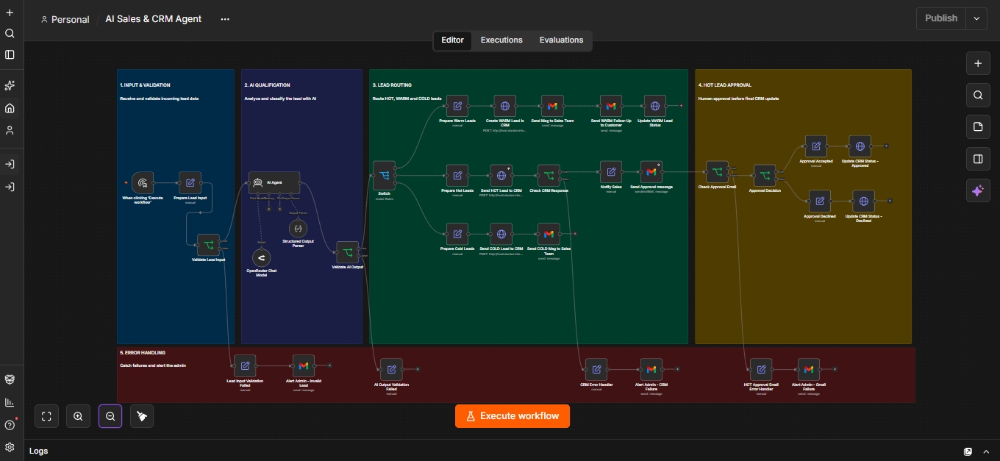
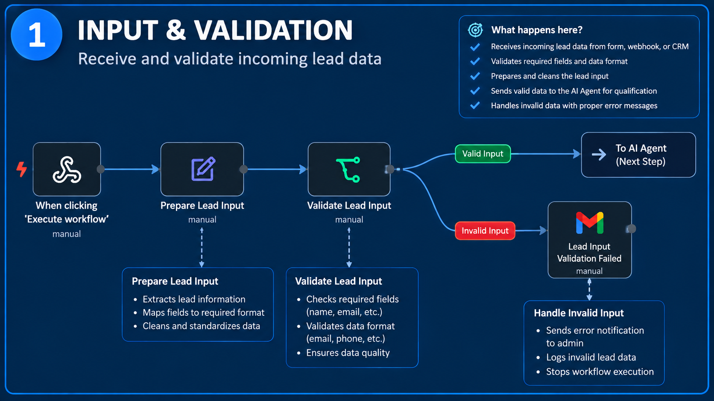
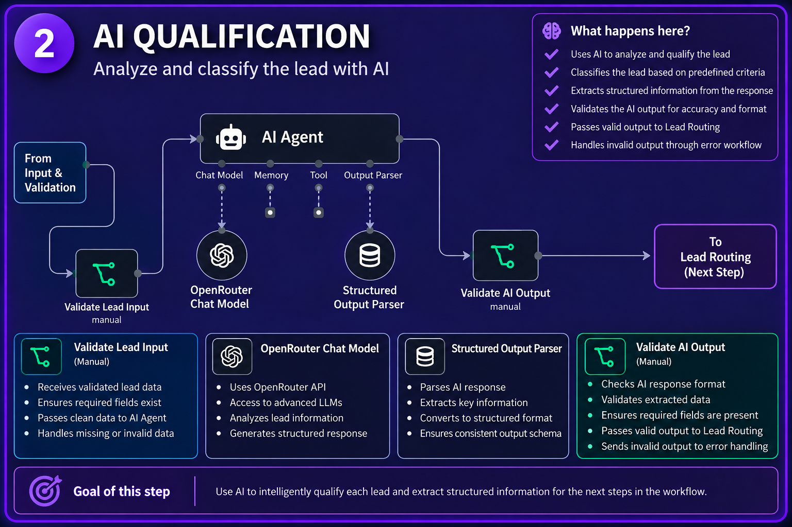
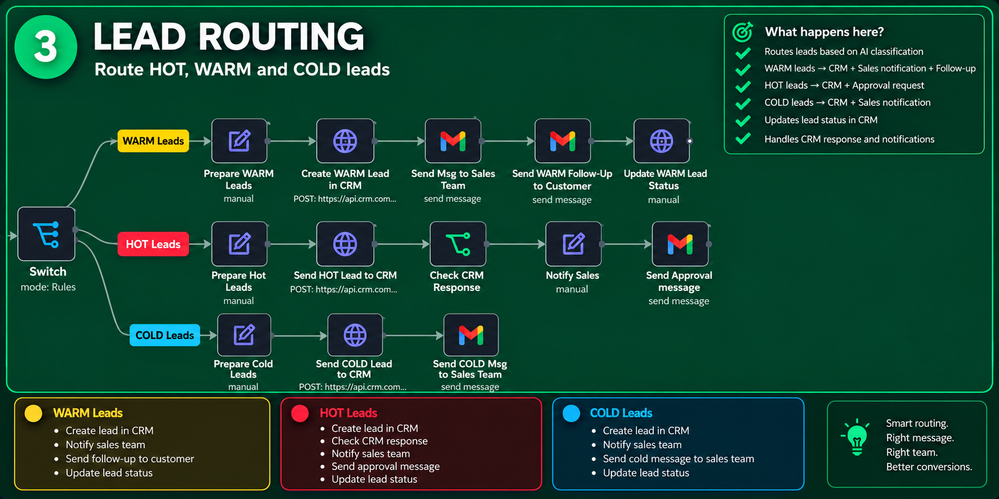
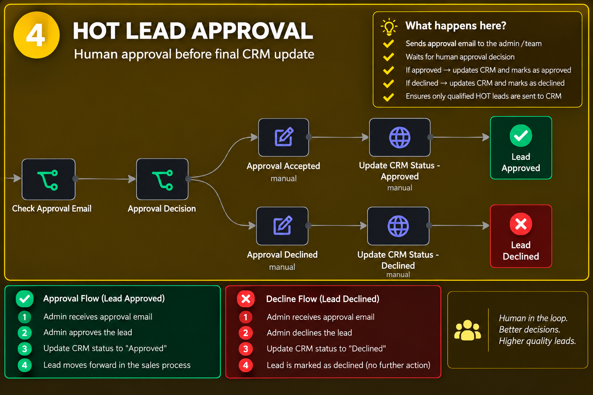
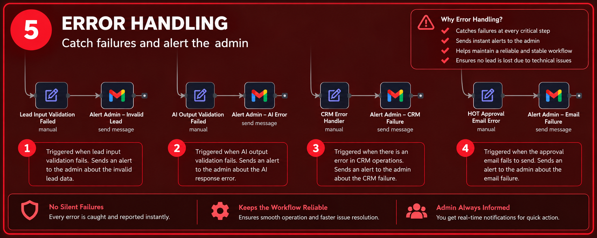

# AI Sales & CRM Automation Agent

An AI-powered lead qualification and sales automation workflow built with n8n, AI, REST APIs, CRM integration, and Gmail.

## 1. Project Overview

The system processes incoming leads, validates their information, uses AI to analyze buying intent, classifies leads as **HOT, WARM, or COLD**, and routes each lead through an appropriate sales workflow.

HOT leads include a human approval step before the final CRM status is updated.

The workflow also includes input validation, AI-output validation, error handling, and administrator alerts.

## 2. Business Problem

Businesses can spend significant time manually reading inquiries, qualifying leads, entering data into a CRM, notifying sales teams, following up with customers, and updating CRM records.

This project automates those repetitive steps while keeping human oversight for high-intent HOT leads.

### Example

A lead that clearly indicates they are ready to start a project and asks for a proposal can be classified as **HOT**.

The system can then create the CRM record, notify sales, request human approval, and update the CRM based on the decision.

## 3. Solution Architecture

```text
Incoming Lead
      ↓
Prepare Lead Input
      ↓
Validate Lead Input
      ↓
AI Agent
      ↓
Validate AI Output
      ↓
HOT / WARM / COLD
      │
      ├── HOT
      │    ↓
      │  Create CRM Record
      │    ↓
      │  Sales Approval
      │    ↓
      │  Approve / Decline
      │    ↓
      │  Update CRM
      │
      ├── WARM
      │    ↓
      │  Create CRM Record
      │    ↓
      │  Notify Sales
      │    ↓
      │  Customer Follow-up
      │
      └── COLD
           ↓
         Create CRM Record
           ↓
         Notify Sales
```

## 4. Technologies Used

| Technology | Purpose |
|---|---|
| n8n | Workflow automation and orchestration |
| AI Agent | Lead analysis and qualification |
| OpenRouter | AI model/API access |
| REST APIs | CRM communication |
| Gmail | Notifications, customer communication, and approval emails |
| CRM | Lead storage and status management |
| Validation / Guardrails | Input and AI-output validation |
| Human-in-the-loop | HOT lead approval |
| Error Workflow | Centralized unexpected-error handling |

## 5. Workflow Breakdown

### Lead Input & Validation

Required lead information is checked before AI processing.

```text
Lead Input
    ↓
Prepare Lead Input
    ↓
Validate Lead Input
    ↓
Valid → AI Agent
Invalid → Admin Alert
```

### AI Qualification

The AI analyzes the customer's request and produces structured information including:

- `name`
- `service`
- `buying_intent`
- `lead_temperature`
- `response`

The lead temperature is classified as exactly one of:

- Hot
- Warm
- Cold

### AI Output Validation

The AI result is validated before downstream CRM and automation steps use it.

```text
AI Agent
   ↓
Validate AI Output
   ↓
Valid → Continue
Invalid → Admin Alert
```

### HOT Workflow

HOT leads go through a human approval process.

```text
HOT Lead
   ↓
CRM
   ↓
Sales Approval
   ↓
Approve / Decline
   ↓
CRM Status Update
```

### WARM Workflow

WARM leads are processed through CRM, sales notification, and customer follow-up steps.

### COLD Workflow

COLD leads are recorded in the CRM and communicated to the sales team.

## 6. Guardrails & Error Handling

The project includes several reliability mechanisms.

### Input Guardrail

Incomplete lead input is blocked before AI processing and routed to an administrator alert.

### AI Output Guardrail

Unexpected or invalid AI output is detected before it reaches downstream business systems.

### CRM Error Handling

Important CRM operations have dedicated error handling so CRM/API failures can be detected and reported.

### HOT Approval Email Error Handling

The HOT approval email has dedicated error handling and administrator notification.

### Centralized Error Workflow

A separate n8n Error Workflow is configured as a fallback for unexpected workflow-level failures.

```text
Unexpected Workflow Error
          ↓
      Error Workflow
          ↓
       Error Trigger
          ↓
       Admin Alert
```

### Human Oversight

The HOT workflow does not rely solely on an automated AI decision. A human approval step is required before the final CRM status is updated.

## 7. Example Lead Scenarios

### HOT

**Example input:**

> We're ready to start our website project. Please send us a proposal and let us know the next steps.

**Expected classification:** Hot

The system creates the CRM record, notifies sales, requests approval, and updates the CRM based on the human decision.

### WARM

**Example input:**

> I'm interested in your website services. Could you tell me more about your process? I'm comparing a few options.

**Expected classification:** Warm

The system creates the CRM record, notifies sales, and sends the appropriate customer follow-up.

### COLD

**Example input:**

> I'm just exploring what AI automation services are available. I'm not planning to start a project right now.

**Expected classification:** Cold

The system records the lead in the CRM and notifies the sales team.

## 8. What This Project Demonstrates

This project demonstrates practical experience with:

- AI-powered workflow automation
- n8n workflow orchestration
- REST API integration
- CRM automation
- Structured AI outputs
- Prompt/system design
- Input and output validation
- Human-in-the-loop workflows
- Gmail automation
- Error handling
- Business process automation

## 9. Security & Credential Handling

**Never publish real credentials in this repository.**

Do not commit:

- OpenRouter API keys
- Google Client IDs or Client Secrets
- OAuth tokens
- CRM API keys
- Passwords
- Webhook secrets
- Personal account credentials

Use placeholders in public examples and keep real credentials inside the appropriate secure environment.

Example:

```env
OPENROUTER_API_KEY=your_openrouter_api_key_here
GOOGLE_CLIENT_ID=your_google_client_id_here
GOOGLE_CLIENT_SECRET=your_google_client_secret_here
CRM_API_URL=your_crm_api_url_here
```

For this public portfolio repository, keep the complete production workflow private and publish only documentation, screenshots, demo material, and (if desired later) a separately sanitized/template workflow.

## 10. Setup Instructions

This repository is intended as a portfolio demonstration.

For a deployment:

1. Install or access n8n.
2. Use the public documentation/screenshots as the reference for the architecture. If a sanitized/template workflow is added later, import that workflow instead of the private production workflow.
3. Configure the required AI provider credentials.
4. Configure Gmail credentials.
5. Configure the CRM/API credentials.
6. Replace placeholder configuration with environment-specific values.
7. Test input validation.
8. Test HOT, WARM, and COLD paths.
9. Test error-handling paths.
10. Publish/activate the workflow when ready for production use.

**Do not use the author's personal credentials. Each deployment should use credentials appropriate to that environment/client.**

## 11. Future Improvements

Possible future extensions include:

- Additional lead sources
- More CRM integrations
- Advanced lead scoring
- Analytics and reporting dashboards
- RAG-based business knowledge
- More advanced AI agents
- Automated follow-up sequences
- Conversation history and memory
- Additional approval workflows
- Production monitoring and observability

## 12. Screenshots & Demo

The following screenshots show the different stages of the AI Sales & CRM Automation Agent workflow.

### Full Workflow Overview



### 1. Input & Validation



The workflow begins by receiving lead information, preparing the input, and validating the required lead data before sending it to the AI qualification stage.

### 2. AI Qualification



The AI Agent analyzes the lead information and classifies the lead as **HOT, WARM, or COLD** using structured output validation.

### 3. Lead Routing



The Switch node routes the qualified lead into the appropriate HOT, WARM, or COLD sales workflow.

### 4. HOT Lead Approval



HOT leads require human approval before the final CRM status is updated.

### 5. Error Handling



Dedicated error-handling paths validate failures and send administrator alerts for input, AI, CRM, and email-related errors.

### Suggested Demo Flow

```text
Lead arrives
    ↓
AI analyzes lead
    ↓
HOT / WARM / COLD
    ↓
CRM record created
    ↓
Sales notification
    ↓
HOT → Human approval
    ↓
CRM status updated
```

## Security Note

This repository is a **portfolio demonstration**, not a copy of the private production setup. The complete reusable workflow and all credentials should remain private.

## Project Status

**Portfolio project — current workflow implementation and testing completed.**

## Repository Scope

This public repository is intentionally focused on demonstrating the project's architecture, automation logic, guardrails, error handling, and business use case.

The private version may contain additional client-specific configuration, credentials, prompts, workflow details, and deployment settings that are not included here.
